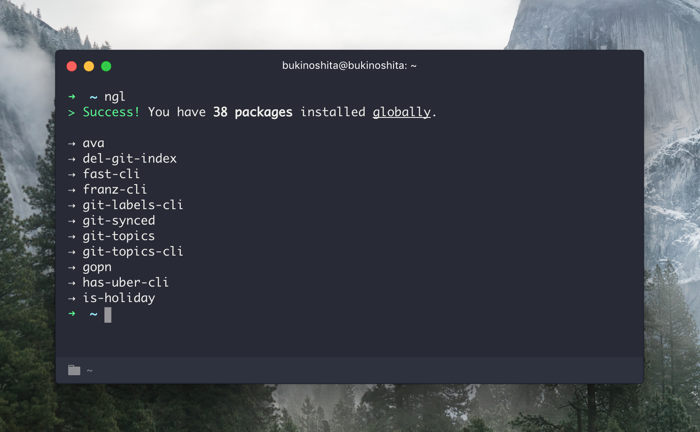

# npm-global-list-cli [](https://travis-ci.org/bukinoshita/npm-global-list-clit)

> Get all npm packages installed globally


## Install

```bash
$ npm install -g npm-global-list-cli
```


## Usage

```bash
$ ngl --help

  Usage:
    $ ngl
    $ ngl -l=100

  Options:
    -l, --limit                 Limit
    -h, --help                  Show help options
    -v, --version               Show version
```


## Demo




## Related

- [npm-global-list](https://github.com/bukinoshita/npm-global-list) — API for this module


## License

MIT © [Bu Kinoshita](https://bukinoshita.io)
